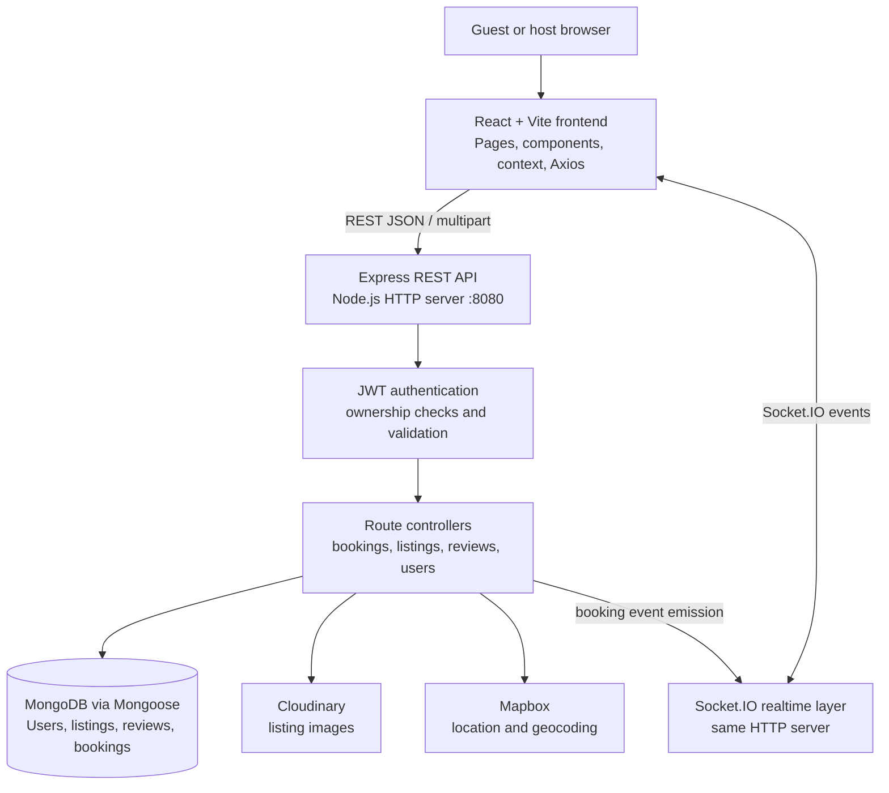
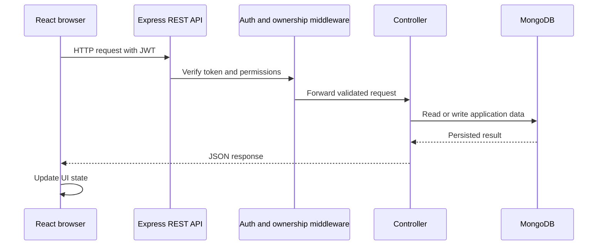
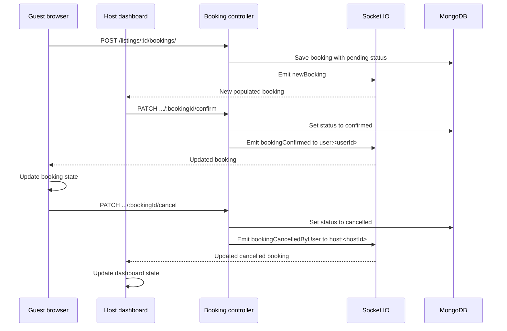
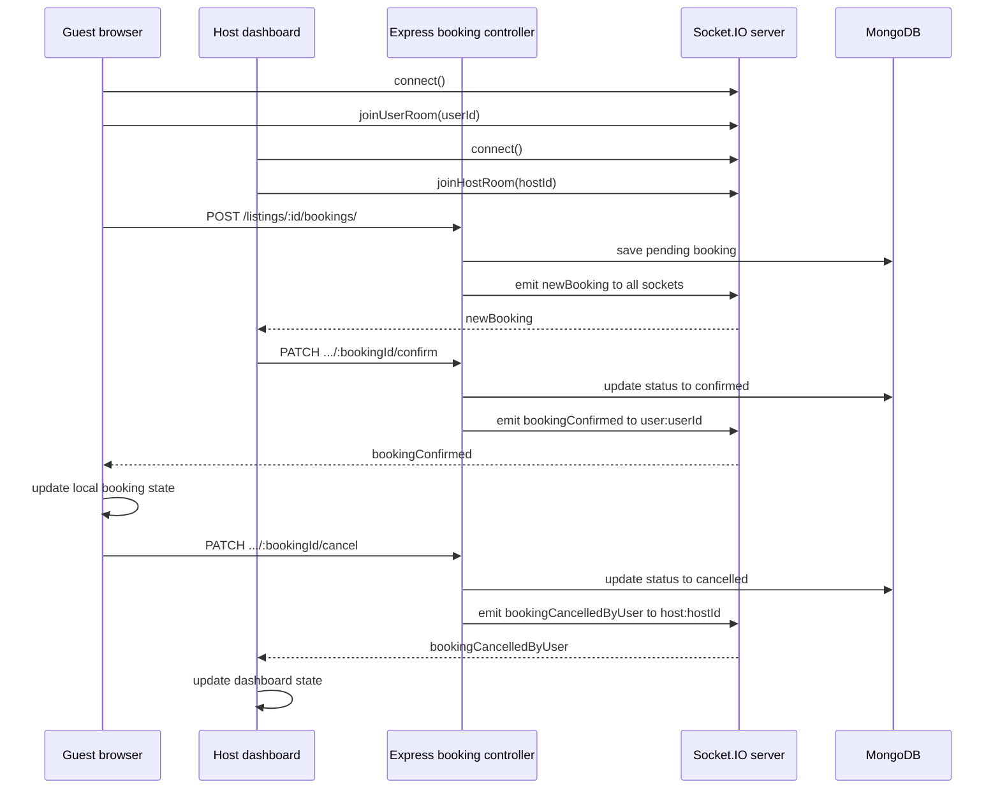

# 🏡 WanderLust

> A full-stack hotel and property listing platform where users can discover accommodations, view property details, make bookings, write reviews, and hosts can manage their listings.

WanderLust is a full-stack accommodation listing platform originally developed with **Node.js, Express.js, MongoDB, and EJS** and currently being evolved into a modern **React + Vite frontend application** while reusing and extending the existing backend architecture.

The project focuses on building a real-world property marketplace with authentication, authorization, property management, reviews, bookings, image handling, and host-side functionality.

---

## 📌 Table of Contents

* [Overview](#-overview)
* [Features](#-features)
* [Technology Stack](#-technology-stack)
* [Application Architecture](#-application-architecture)
* [System Flow](#-system-flow)
* [Frontend Architecture](#-frontend-architecture)
* [Backend Architecture](#-backend-architecture)
* [Socket.IO Infrastructure](#-socketio-infrastructure)
* [Authentication & Authorization](#-authentication--authorization)
* [Listing & Review Architecture](#-listing--review-architecture)
* [Project Structure](#-project-structure)
* [Frontend Routing](#-frontend-routing)
* [API Architecture](#-api-architecture)
* [Database](#-database)
* [Image Upload](#-image-upload)
* [Development Roadmap](#-development-roadmap)
* [Installation](#-installation)
* [Environment Variables](#-environment-variables)
* [Running the Project](#-running-the-project)
* [Learning Objectives](#-learning-objectives)
* [Future Improvements](#-future-improvements)
* [Author](#-author)

---

# 🌍 Overview

WanderLust is designed as a vacation rental and hotel listing platform.

The application provides two primary types of users:

### 👤 Guest / User

Users can:

* Create an account
* Login securely
* Browse available properties
* Search properties
* View detailed property information
* View property images
* Read reviews and ratings
* Submit reviews
* Book properties
* Manage their booking-related interactions

### 🏠 Host / Owner

Hosts can:

* Become a host
* Create property listings
* Edit their listings
* Delete their listings
* Manage their properties
* View host-specific information
* Manage bookings
* Access a host dashboard

The application uses authentication and authorization to ensure that protected operations are available only to authenticated users and that owners can manage only the resources they are authorized to manage.

---

# ✨ Features

## 🔐 Authentication

* User registration
* User login
* JWT-based authentication
* Password hashing
* Protected routes
* Authentication state management
* Logout functionality

---

## 🛡️ Authorization

WanderLust uses authorization to control access to protected operations.

Examples:

* Only authenticated users can perform protected actions.
* Only authorized owners can modify their listings.
* Users cannot modify another user's resources.
* Review operations require authentication.
* Host-specific functionality is protected.

---

## 🏡 Property Listings

Users can browse available accommodations.

Each listing can contain information such as:

* Title
* Description
* Location
* Country
* Price
* Images
* Property information
* Reviews
* Rating information

Hosts can perform CRUD operations on their properties:

```text
Create
  ↓
Read
  ↓
Update
  ↓
Delete
```

---

## 🔎 Search

The frontend provides listing search functionality.

The React implementation uses URL search parameters to handle searches and filters listings based on the user's query.

Basic flow:

```text
User enters search
        ↓
SearchBar
        ↓
URL Search Parameters
        ↓
SearchResultPage
        ↓
Filter Listings
        ↓
Render ListingCard
```

---

## 📝 Reviews & Ratings

WanderLust includes a review and rating system.

Users can:

* View reviews
* Submit reviews
* Provide ratings
* See reviews associated with a listing

The project also includes validation to prevent duplicate reviews.

The review architecture follows:

```text
ListingDetailsPage
        │
        ▼
ReviewSection
        │
        ├──────────────► ReviewList
        │                    │
        │                    ▼
        │               ReviewCard
        │
        ▼
ReviewForm
```

After a successful review submission, the listing is refreshed from the backend so the newly submitted review appears immediately without requiring a browser refresh.

```text
ReviewForm
    │
    │ POST review
    ▼
Backend
    │
    │ Success
    ▼
refreshListing()
    │
    ▼
GET /listings/:id
    │
    ▼
setListing()
    │
    ▼
ReviewList re-renders
```

This keeps the frontend state synchronized with the backend.

---

# 🛒 Booking

WanderLust includes booking functionality for properties.

The booking flow is designed around:

```text
User
 ↓
Listing Details
 ↓
Select Booking Information
 ↓
Booking Request
 ↓
Backend
 ↓
Booking Validation
 ↓
Database
 ↓
Booking Confirmation
```

Booking UI improvements are part of the current development roadmap.

---

# 🏠 Host Dashboard

The Host Dashboard provides hosts with a dedicated area for managing their properties and host-related activities.

Planned/implemented host functionality includes:

* Host overview
* Listing management
* Booking-related information
* Host statistics
* Property management

Host Analytics is planned as a later Version 2 enhancement.

---

# 🖼️ Image Management

WanderLust supports property image handling.

The project uses **Cloudinary** for image hosting, while local/static assets can be maintained inside the frontend assets directory.

Image-related functionality includes:

* Property images
* Image upload
* Image preview
* Cloud-based image storage

Image Preview is part of the Version 1 development roadmap.

---

# 🛠️ Technology Stack

## Frontend

| Technology            | Purpose                         |
| --------------------- | ------------------------------- |
| **React.js**          | User interface                  |
| **Vite**              | Frontend development/build tool |
| **React Router DOM**  | Client-side routing             |
| **Tailwind CSS**      | UI styling                      |
| **React Icons**       | UI icons                        |
| **Context API**       | Global authentication state     |
| **Socket.IO Client**  | Realtime booking updates        |
| **JavaScript (ES6+)** | Application logic               |

---

## Backend

| Technology     | Purpose                    |
| -------------- | -------------------------- |
| **Node.js**    | JavaScript runtime         |
| **Express.js** | REST API framework         |
| **MongoDB**    | Database                   |
| **Mongoose**   | MongoDB ODM                |
| **JWT**        | Authentication             |
| **bcrypt**     | Password hashing           |
| **Cloudinary** | Image hosting              |
| **dotenv**     | Environment configuration  |
| **CORS**       | Cross-origin communication |

---

# 🏗️ Application Architecture

WanderLust uses a modular client-server architecture. REST APIs handle durable application data, while Socket.IO provides realtime booking updates over the same Node.js HTTP server.



### Communication responsibilities

| Layer | Responsibility |
| --- | --- |
| React frontend | Renders listings, booking pages, and host dashboard; keeps realtime state in sync |
| Express REST API | Validates requests, authenticates users, applies ownership rules, and returns JSON |
| Booking controllers | Creates, confirms, and cancels bookings; emits the matching realtime event |
| MongoDB | Persists users, listings, reviews, and booking lifecycle state |
| Socket.IO | Delivers booking changes without requiring a page refresh |
| Cloudinary / Mapbox | Stores listing images and supports listing location data |

## 🔄 HTTP Request Flow



## 🔌 Realtime Booking Flow

Socket.IO is initialized on the same server as Express. Clients join user or host rooms after connecting, and booking controllers emit events after a successful database update.



### Socket.IO rooms and events

| Event | Direction | Room / delivery | Purpose |
| --- | --- | --- | --- |
| `joinUserRoom(userId)` | Client → server | `user:<userId>` | Receives targeted updates for the logged-in guest |
| `joinHostRoom(hostId)` | Client → server | `host:<hostId>` | Receives targeted updates for the listing owner |
| `newBooking` | Server → clients | Current global broadcast | Adds a newly created booking to the host dashboard |
| `bookingConfirmed` | Server → client | `user:<userId>` | Updates a guest booking after host confirmation |
| `bookingCancelledByUser` | Server → host | `host:<hostId>` | Updates the host dashboard after guest cancellation |

REST remains the source of truth; Socket.IO only synchronizes the relevant UI state after the database operation succeeds.

# ⚛️ Frontend Architecture

The React frontend is structured using reusable components and pages.

The major architecture is:

```text
App
 │
 ├── AppRoutes
 │      │
 │      ├── MainLayout
 │      │      │
 │      │      ├── Navbar
 │      │      │     ├── Logo
 │      │      │     ├── SearchBar
 │      │      │     └── NavActions
 │      │      │
 │      │      └── Outlet
 │      │
 │      ├── HomePage
 │      ├── SearchResultPage
 │      ├── ListingDetailsPage
 │      ├── Login
 │      ├── Signup
 │      ├── CreateListing
 │      ├── EditListing
 │      ├── MyListings
 │      ├── Profile
 │      └── HostDashboard
 │
 └── AuthContext
```

---

# 🧩 Important Frontend Components

### Navbar

The Navbar acts as the main navigation interface.

It contains reusable components such as:

```text
Navbar
 ├── Logo
 ├── SearchBar
 └── NavActions
```

---

### SearchBar

The SearchBar handles user search input.

Concepts used:

* `useState`
* Event handling
* URL search parameters
* React Router

---

### ListingCard

`ListingCard` is a reusable component responsible for displaying a property preview.

Typical information:

```text
Image
Title
Location
Country
Price
```

Multiple ListingCards are rendered using:

```text
listings.map(...)
```

---

### Listing Details

The listing details page uses the route parameter to identify the requested property.

Conceptually:

```text
/listings/:id
       │
       ▼
useParams()
       │
       ▼
Find Listing
       │
       ▼
ListingDetailsPage
```

---

# 🔌 Socket.IO Infrastructure

The backend creates Socket.IO on the same Node HTTP server as Express. The frontend connects automatically to `http://localhost:8080` through `frontend/src/services/socket.js`.

## Current event contract

| Direction | Event | Delivery | Current behavior |
| --- | --- | --- | --- |
| Client -> server | `joinUserRoom(userId)` | User room | Joins `user:<userId>` for targeted confirmation updates |
| Client -> server | `joinHostRoom(hostId)` | Host room | Joins `host:<hostId>` for targeted guest-cancellation updates |
| Server -> client | `newBooking` | Global broadcast | Host dashboard prepends the populated booking to local state |
| Server -> client | `bookingConfirmed` | `user:<userId>` | My Bookings updates the matching booking without a page refresh |
| Server -> client | `bookingCancelledByUser` | `host:<hostId>` | Host dashboard updates the matching booking status |



## Realtime status

* Host-to-user confirmation is implemented and verified without a browser refresh.
* Guest-to-host cancellation is implemented through `bookingCancelledByUser` and the host room.
* `newBooking` remains a global broadcast; confirmation and guest cancellation use targeted user/host rooms.
* Host-to-user cancellation currently changes MongoDB state through REST only and has no guest-facing realtime event.

The detailed HTTP and event contract is maintained in [API_DOCUMENTATION.md](API_DOCUMENTATION.md).

# 🔐 Authentication & Authorization

Authentication is responsible for verifying the identity of a user.

Authorization determines whether that authenticated user is allowed to perform a specific action.

The overall flow is:

```text
                    AUTHENTICATION FLOW

User
 │
 ├── Signup
 │      │
 │      ▼
 │   Backend
 │      │
 │      ▼
 │   Validate User
 │      │
 │      ▼
 │   Hash Password
 │      │
 │      ▼
 │   Save User
 │
 └── Login
        │
        ▼
     Backend
        │
        ▼
   Find User
        │
        ▼
 Compare Password
        │
        ▼
 Generate JWT
        │
        ▼
 Return Token
        │
        ▼
 React Auth State
```

For protected requests:

```text
React
 │
 ▼
JWT Token
 │
 ▼
Authorization Header
 │
 ▼
Express Middleware
 │
 ▼
Verify JWT
 │
 ▼
Authenticated User
 │
 ▼
Protected Route
 │
 ▼
Authorization Check
 │
 ▼
Database Operation
```

Passwords are hashed before storage, and JWT is used to authenticate protected requests.

---

# 📝 Listing & Review Architecture

The listing details page acts as the parent component for listing-related information.

```text
ListingDetailsPage
 │
 ├── ListingHero
 │
 ├── ListingInfo
 │
 └── ReviewSection
        │
        ├── ReviewList
        │      └── ReviewCard
        │
        └── ReviewForm
```

`ListingDetailsPage` owns the listing data and provides a `refreshListing()` function to the review components.

When a review is submitted:

```text
ReviewForm
    │
    ▼
POST Review
    │
    ▼
Backend
    │
    ▼
Review Saved
    │
    ▼
refreshListing()
    │
    ▼
GET Listing
    │
    ▼
Update listing state
    │
    ▼
ReviewList
    │
    ▼
New Review Displayed
```

This avoids requiring a full browser reload.

---

# 📂 Project Structure

The project is being organized into separate frontend and backend applications.

```text
WanderLust/
│
├── backend/
│   │
│   ├── config/
│   │   └── cloudConfig.js
│   │
│   ├── controllers/
│   │   ├── bookings.js
│   │   ├── dashboard.js
│   │   ├── listings.js
│   │   ├── reviews.js
│   │   └── users.js
│   │
│   ├── init/
│   │   ├── data.js
│   │   └── index.js
│   │
│   ├── middleware/
│   │   ├── authMiddleware.js
│   │   └── index.js
│   │
│   ├── models/
│   │   ├── booking.js
│   │   ├── listing.js
│   │   ├── review.js
│   │   └── user.js
│   │
│   ├── public/
│   │   ├── CSS/
│   │   │   ├── rating.css
│   │   │   └── style.css
│   │   │
│   │   └── js/
│   │       ├── map.js
│   │       └── script.js
│   │
│   ├── routes/
│   │   ├── booking.js
│   │   ├── dashboard.js
│   │   ├── listing.js
│   │   ├── review.js
│   │   └── user.js
│   │
│   ├── utils/
│   │   ├── ExpressError.js
│   │   └── wrapAsync.js
│   │
│   ├── .env
│   ├── app.js
│   ├── package-lock.json
│   ├── package.json
│   └── schema.js
│
│
├── frontend/
│   │
│   ├── node_modules/
│   │
│   ├── public/
│   │
│   ├── src/
│   │   │
│   │   ├── assets/
│   │   │
│   │   ├── components/
│   │   │   │
│   │   │   ├── Auth/
│   │   │   │   ├── AuthButton.jsx
│   │   │   │   ├── AuthInput.jsx
│   │   │   │   ├── AuthLayout.jsx
│   │   │   │   ├── Divider.jsx
│   │   │   │   └── SocialLoginButton.jsx
│   │   │   │
│   │   │   ├── Bookings/
│   │   │   │   └── HostBookingCard.jsx
│   │   │   │
│   │   │   ├── Categories/
│   │   │   │   ├── Categories.jsx
│   │   │   │   └── CategoryItem.jsx
│   │   │   │
│   │   │   ├── HostDashboard/
│   │   │   │   ├── DashboardStats.jsx
│   │   │   │   ├── HostBookings.jsx
│   │   │   │   ├── MyListings.jsx
│   │   │   │   └── StatCard.jsx
│   │   │   │
│   │   │   ├── ListingDetails/
│   │   │   │   ├── Amenities.jsx
│   │   │   │   ├── BookingCard.jsx
│   │   │   │   ├── HostInfo.jsx
│   │   │   │   ├── ListingDescription.jsx
│   │   │   │   ├── ListingHero.jsx
│   │   │   │   └── ListingInfo.jsx
│   │   │   │
│   │   │   ├── Listings/
│   │   │   │   ├── ListingCard.jsx
│   │   │   │   └── Listings.jsx
│   │   │   │
│   │   │   ├── MyBookings/
│   │   │   │   └── MyBookingCard.jsx
│   │   │   │
│   │   │   ├── Navbar/
│   │   │   │   ├── Logo.jsx
│   │   │   │   ├── NavActions.jsx
│   │   │   │   ├── Navbar.jsx
│   │   │   │   ├── NavLinks.jsx
│   │   │   │   ├── ProfileMenu.jsx
│   │   │   │   └── SearchBar.jsx
│   │   │   │
│   │   │   ├── NewListing/
│   │   │   │   └── NewListingForm.jsx
│   │   │   │
│   │   │   ├── Profile/
│   │   │   │   ├── EditProfileModal.jsx
│   │   │   │   ├── ProfileHeader.jsx
│   │   │   │   └── UserInfoCard.jsx
│   │   │   │
│   │   │   ├── Reviews/
│   │   │   │   ├── ReviewCard.jsx
│   │   │   │   ├── ReviewForm.jsx
│   │   │   │   ├── ReviewList.jsx
│   │   │   │   └── ReviewSection.jsx
│   │   │   │
│   │   │   └── ProtectedRoute.jsx
│   │   │
│   │   ├── context/
│   │   │   └── AuthContext.jsx
│   │   │
│   │   ├── data/
│   │   │   └── categories.js
│   │   │
│   │   ├── hooks/
│   │   │   └── useAuth.js
│   │   │
│   │   ├── layouts/
│   │   │   └── MainLayout.jsx
│   │   │
│   │   ├── pages/
│   │   │   ├── BecomeHostPage.jsx
│   │   │   ├── EditListingPage.jsx
│   │   │   ├── HomePage.jsx
│   │   │   ├── HostDashboardPage.jsx
│   │   │   ├── ListingDetailsPage.jsx
│   │   │   ├── LoginPage.jsx
│   │   │   ├── MyBookingPage.jsx
│   │   │   ├── MyListingsPage.jsx
│   │   │   ├── NewListingPage.jsx
│   │   │   ├── ProfilePage.jsx
│   │   │   ├── SearchResultPage.jsx
│   │   │   └── SignupPage.jsx
│   │   │
│   │   ├── routes/
│   │   │   └── AppRoutes.jsx
│   │   │
│   │   ├── services/
│   │   │   ├── api.js
│   │   │   ├── authService.js
│   │   │   └── listingService.js
│   │   │
│   │   ├── App.css
│   │   ├── App.jsx
│   │   ├── index.css
│   │   └── main.jsx
│   │
│   ├── .env
│   ├── .gitignore
│   ├── eslint.config.js
│   ├── index.html
│   ├── package-lock.json
│   ├── package.json
│   └── vite.config.js
│
├── .gitignore
└── README.md
```

> The exact backend filenames may differ depending on the final refactoring of the original EJS application.

---

# 🧭 Frontend Routing

React Router DOM is used for client-side navigation.

The main routing architecture is:

```text
/
│
├── HomePage
│
├── /search
│      └── SearchResultPage
│
├── /listings/:id
│      └── ListingDetailsPage
│
├── /login
│      └── Login
│
├── /signup
│      └── Signup
│
├── /listings/new
│      └── Create Listing
│
├── /listings/:id/edit
│      └── Edit Listing
│
├── /my-listings
│      └── My Listings
│
├── /profile
│      └── Profile
│
└── /host
       └── Host Dashboard
```

The application also uses a `MainLayout` containing the Navbar and an `Outlet` for nested routes.

---

# 🔌 API Architecture

The frontend communicates with the backend through REST APIs.

The major API categories are:

```text
Authentication
    │
    ├── Signup
    └── Login

Listings
    │
    ├── Create
    ├── Read
    ├── Update
    └── Delete

Reviews
    │
    ├── Create
    ├── Read
    └── Delete

Bookings
    │
    ├── Create
    ├── Read
    └── Manage

User
    │
    ├── Profile
    └── Authentication
```

The original backend architecture was built around RESTful endpoints for property CRUD, authentication, and review management.

---

# 🗄️ Database

MongoDB is used as the primary database.

Mongoose is used to define schemas and communicate with MongoDB.

The main conceptual entities are:

```text
                    ┌──────────────┐
                    │     User     │
                    └──────┬───────┘
                           │
                 ┌─────────┴─────────┐
                 │                   │
                 ▼                   ▼
          ┌─────────────┐      ┌─────────────┐
          │   Listing   │      │   Booking   │
          └──────┬──────┘      └─────────────┘
                 │
                 ▼
          ┌─────────────┐
          │   Review    │
          └─────────────┘
```

### User

Contains authentication and user information.

Conceptually:

```text
User
 ├── username
 ├── email
 ├── password hash and salt
 └── Passport-local authentication fields
```

### Listing

Represents a property available on the platform.

```text
Listing
 ├── title
 ├── description
 ├── price
 ├── location
 ├── country
 ├── images
 ├── owner
 └── reviews
```

### Review

Represents feedback associated with a listing.

```text
Review
 ├── comment
 ├── rating
 ├── author
 └── listing
```

### Booking

Represents a user's booking interaction with a property.

```text
Booking
 ├── user
 ├── listing
 ├── booking information
 └── status
```

---

# ☁️ Image Upload

Cloudinary is used for image hosting.

The image flow is:

```text
User
 │
 ▼
Select Image
 │
 ▼
Frontend Form
 │
 ▼
Backend Upload
 │
 ▼
Cloudinary
 │
 ▼
Image URL
 │
 ▼
MongoDB Listing
 │
 ▼
Frontend
```

The listing stores the Cloudinary image information rather than storing the actual image file directly inside MongoDB.

---

# 🗺️ Development Roadmap

The current development roadmap is divided into two versions.

## Version 1

### 1. Host Dashboard

Build and polish the host-specific dashboard.

### 2. Booking UI Improvements

Improve the booking experience and user interface.

### 3. Image Preview

Add image preview before uploading property images.

### 4. Toast Polish

Improve success/error feedback throughout the application.

### 5. Deployment

Prepare the frontend and backend for production deployment.

---

# Version 2

The second version contains additional enhancements:

* Wishlist
* Skeleton UI
* MyListingCard
* Host Analytics
* Profile Image
* Change Password
* Notifications

---

# 🚧 Current Development Direction

The project is being developed incrementally rather than rebuilding the entire application at once.

The current direction is:

```text
Existing EJS Backend
        │
        │ Reuse / Extend
        ▼
REST APIs
        │
        ▼
React + Vite Frontend
        │
        ▼
Reusable Components
        │
        ▼
Modern UI / UX
        │
        ▼
Production Deployment
```

The frontend migration allows the original backend functionality to be retained while providing a more component-based and maintainable user interface.

---

# 📦 Installation

## 1. Clone the repository

```bash
git clone <your-repository-url>
cd WanderLust
```

---

## 2. Install backend dependencies

```bash
cd backend
npm install
```

---

## 3. Install frontend dependencies

Open another terminal:

```bash
cd frontend
npm install
```

---

# 🔑 Environment Variables

Create a `.env` file inside the backend directory.

Example:

```env
ATLASDB_URL=your_mongodb_connection_string
SECRET=your_session_secret
JWT_SECRET=your_jwt_secret
MAP_TOKEN=your_mapbox_token
CLOUD_NAME=your_cloudinary_cloud_name
CLOUD_API_KEY=your_cloudinary_api_key
CLOUD_API_SECRET=your_cloudinary_api_secret
```

The backend currently listens on hard-coded port `8080`; `PORT` is not read by `backend/app.js`. The frontend and Socket.IO client expect `http://localhost:8080` and `http://localhost:5173` during local development.

Do not commit `.env` to GitHub.

Add it to `.gitignore`:

```text
.env
node_modules/
```

---

# ▶️ Running the Project

## Start Backend

```bash
cd backend
npm run dev
```

The backend runs on:

```text
http://localhost:8080
```

---

## Start Frontend

In another terminal:

```bash
cd frontend
npm run dev
```

Vite will provide the local development URL, commonly:

```text
http://localhost:5173
```

---

# 🧪 Development Workflow

The project follows an incremental development workflow.

```text
Requirement
     ↓
Plan
     ↓
Component / API Design
     ↓
Implementation
     ↓
Testing
     ↓
Debugging
     ↓
UI / UX Polish
     ↓
Integration
     ↓
Deployment
```

For frontend development, functionality is divided into reusable React components rather than placing all logic inside a single page.

---

# 🎯 Learning Objectives

WanderLust is also being used as a practical full-stack learning project.

The project covers:

### React

* Components
* Props
* State
* `useState`
* `useEffect`
* `useParams`
* `useSearchParams`
* Context API
* Event handling
* Forms
* Conditional rendering
* List rendering
* Component composition

### React Router

* Routes
* Nested routes
* Layouts
* URL parameters
* Search parameters
* Navigation

### Backend

* Node.js
* Express.js
* REST APIs
* Middleware
* Controllers
* Authentication
* Authorization
* CRUD operations

### Database

* MongoDB
* Mongoose
* Schemas
* Models
* Relationships
* Validation

### Authentication

* Password hashing
* JWT
* Protected routes
* Authorization

### Full-Stack Integration

```text
React
  ↕
REST API
  ↕
Express
  ↕
Mongoose
  ↕
MongoDB
```

---

# 🔒 Security Considerations

The project includes or is designed around:

* Password hashing
* JWT authentication
* Protected API routes
* Authorization checks
* User ownership validation
* Environment variables for secrets
* Input validation
* CORS configuration

Sensitive credentials such as database URLs, JWT secrets, and Cloudinary credentials must never be committed to the repository.

---

# 📈 Future Improvements

Planned improvements include:

* Wishlist functionality
* Skeleton loading UI
* Dedicated My Listing cards
* Host analytics
* Profile image
* Change password
* Notifications
* Improved booking experience
* Better image upload/preview experience
* Toast notification polish
* Production deployment

Additional improvements can be introduced as the application evolves.

---

# 🚀 Project Vision

The long-term goal of WanderLust is to evolve from a basic accommodation listing application into a complete full-stack property marketplace.

The intended ecosystem is:

```text
                         WANDERLUST
                              │
          ┌───────────────────┼───────────────────┐
          │                   │                   │
          ▼                   ▼                   ▼
       Guests              Hosts              Platform
          │                   │                   │
          ▼                   ▼                   ▼
      Discover            Manage              Manage
      Properties          Listings            Platform
          │                   │                   │
          ▼                   ▼                   ▼
       Reviews             Bookings           Analytics
          │                   │                   │
          └───────────────────┼───────────────────┘
                              ▼
                       Complete Platform
```

---

# 👨‍💻 Author

**Vivek Kumar**

B.Tech Computer Science & Engineering

Jagannath University, Jaipur

### Technical Focus

* Full-Stack Development
* MERN Stack
* React.js
* Node.js
* Express.js
* MongoDB
* REST APIs
* JavaScript
* Data Structures & Algorithms

---

# 📄 License

This project is developed for educational, portfolio, and learning purposes.

If a formal open-source license is added later, this section should be updated accordingly.

---

## ⭐ Project Status

**WanderLust is actively under development.**

The project is transitioning from its original EJS-based frontend architecture toward a modern React + Vite frontend while continuing to build upon the existing backend functionality.

The current implementation status is:

```text
Socket.IO confirmation                 DONE
Host -> User confirmation              DONE
Realtime confirmation without refresh  VERIFIED
Host -> User cancellation               PENDING
```

The remaining cancellation work requires a backend cancellation event and a guest-side listener/state update. Host-room targeting also remains pending because `newBooking` is currently broadcast globally.

---
